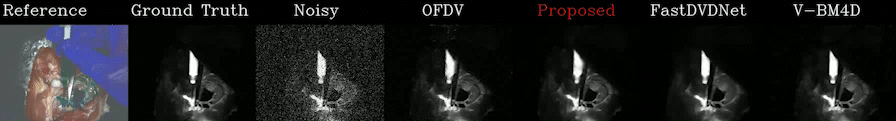

# OFDVDnet
A denoising algorithm for Poisson noise corrupted videos captured by a shot-noise limited camera (such as SPAD camera) utilizing optical flow motion compensation and sensor fusion of a CMOS camera and the shot noise limited camera.

## Overview
This repository contains the original code implementation for the paper ["OFDVDnet: A Sensor Fusion Approach for Video Denoising in Fluorescence-Guided Surgery" Medical Imaging with Deep Learning (2023)](https://openreview.net/forum?id=TcUtCXRcK8), as well as the in-house captured flourescence guilded surgery (FGS) dataset for training and evaluations. 

OFDVDnet is a two-step denoising algorithm consisting of the following:
  - Optical flow denoising 
  - Neural network denoising

An overview of OFDVDnet's denoising pipeline is shown in the figure below.

> 

## Environment Requirement
  - Python 3
  - Pytorch
  - Numpy
  - Matplotlib
  - OpenCV 

## Dataset

## Usage
### Step 1: Optical Flow Denoising
1) Unzip data.zip
2) run code/generate_OFDV.py
   
   NOTE: this generates ~1TB of files to be used for training the NN. 

### Step 2: Neural Network Denoising

## Results
| SBR | OFDVDnet      | OFDV          | FastDVDnet    | V-BM4D        | Guided Filtering| Joint Bilateral |
|:---:|     :---:     |     :---:     |     :---:     |     :---:     |      :---:      |      :---:      |
| 0.1 | 29.3/.76/.88  | 10.8/.015/.20 | 24.3/.48/.83  | 19.7/.19/.52  | 16.4/.19/.69    | 15.8/.11/.59    |
| 0.5 | 34.0/.89/.93  | 21.5/.22/.52  | 30.8/.80/.88  | 29.9/.61/.86  | 28.1/.61/.86    | 26.3/.52/.81    |
| 2.0 | 36.9/.92/.95  | 30.8/.72/.82  | 35.7/.89/.93  | 36.7/.88/.92  | 33.7/.90/.92    | 31.5/.85/.90    |

> ### SBR = 0.1
> 

> ### SBR = 0.5
> 

> ### SBR = 2.0
> 

> 

### Limitations
> 

## License 
