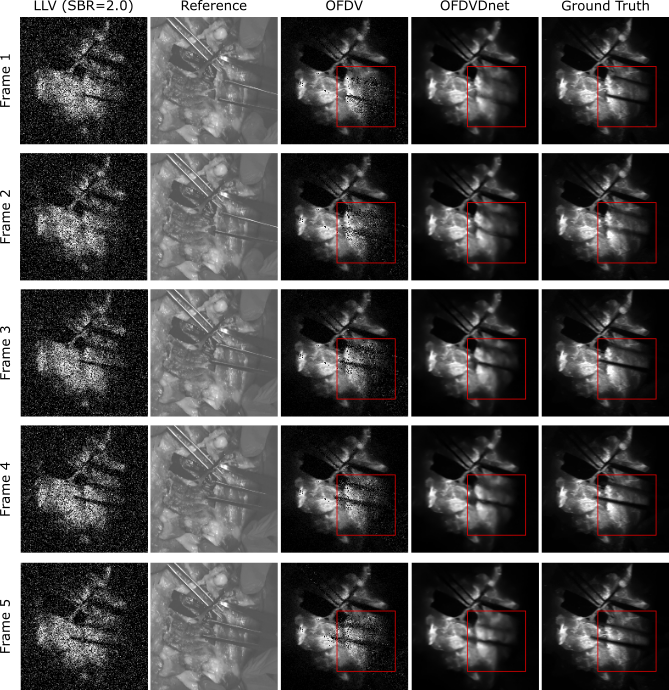

# OFDVDnet
A denoising algorithm for Poisson noise corrupted videos captured by a shot-noise limited camera (such as SPAD camera) utilizing optical flow motion compensation and sensor fusion of a CMOS camera and the shot noise limited camera.

## Overview
This repository contains the original code implementation for the paper ["OFDVDnet: A Sensor Fusion Approach for Video Denoising in Fluorescence-Guided Surgery" Medical Imaging with Deep Learning (2023)](https://openreview.net/pdf?id=TcUtCXRcK8), as well as the in-house captured flourescence guilded surgery (FGS) dataset for training and evaluations. 

OFDVDnet is a two-step video denoising algorithm consisting of the following:
  - Optical flow denoising 
  - Neural network denoising

An overview of OFDVDnet's denoising pipeline is shown in the figure below.

> 

## Environment Requirement
  - Python 3
  - Pytorch
  - Numpy
  - Matplotlib
  - OpenCV 

## Dataset
The in-house collected FGS dataset is stored in dataset.zip. The dataset contains aligned Reference Video (RV) and Low Light Video (LLV) video frames captured using a commercial FGS imaging system (OnLume Surgical, Madison, WI) in a simulated surgery based on the blue blood chicken model used in micro-surgical training. 

## Usage
### Step 1:
Download data from Google Drive using the following link:
>https://drive.google.com/file/d/1ZFSXxlptYIQ_xnZM0E1EtR3xSYrI10RQ/view?usp=sharing

We recommend placing /data immediately under /OFDVDnet such that the relative path to /data is: ./OFDVDnet/data/

### Step 2: Optical Flow Denoising
1) Unzip data.zip
2) run code/generate_OFDV.py
   
   NOTE: this generates ~1TB of files to be used for training the NN. 

### Step 3: Neural Network Denoising
1) Training:
> python OFDVDnet_train.py

Customizable prameters through commandline flags: nunber of training epochs, noise level, directory of input data.
More information about available flags and default argument values:
> python OFDVDnet_train.py -h

2) Evaluation:
> python OFDVDnet_evaluate.py

Customizable prameters through commandline flags: nunber of training epochs, noise level, directory of input data.
More information about available flags and default argument values:
> python OFDVDnet_evaluate.py -h

## Results
| SBR*  | OFDVDnet      | OFDV          | FastDVDnet    | V-BM4D        | Guided Filtering| Joint Bilateral |
| :---: |     :---:     |     :---:     |     :---:     |     :---:     |      :---:      |      :---:      |
| 0.1   | 29.3/.76/.88  | 10.8/.015/.20 | 24.3/.48/.83  | 19.7/.19/.52  | 16.4/.19/.69    | 15.8/.11/.59    |
| 0.5   | 34.0/.89/.93  | 21.5/.22/.52  | 30.8/.80/.88  | 29.9/.61/.86  | 28.1/.61/.86    | 26.3/.52/.81    |
| 2.0   | 36.9/.92/.95  | 30.8/.72/.82  | 35.7/.89/.93  | 36.7/.88/.92  | 33.7/.90/.92    | 31.5/.85/.90    |

> * SBR is a self-defined parameter to describe noise level, lower SBR corresponds to noisier LLV. Refer to paper for more details. 

Comparison of video results of OFDVDnet and FastDVDnet, V-BM4D at SBR = 0.1, 0.5 and 2.0. For more video results, please visit our [YouTube channel](https://www.youtube.com/@fgs_denoising/playlists) or download from our [Google Drive]({https://drive.google.com/drive/folders/1QarTJx4h7TiVlR2zekRwcmqoV9fRL8Je?usp=sharing)

> ### SBR = 0.1
> 

> ### SBR = 0.5
> 

> ### SBR = 2.0
> 

> 

### Limitations
> 

## License 
